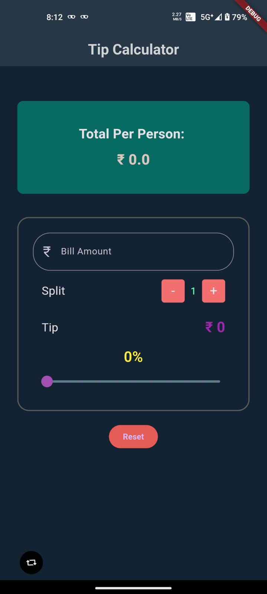

# Tip Calculator

A simple Flutter application to calculate tips based on the bill amount, tip percentage, and the number of people splitting the bill.

## Features

- **Bill Amount:** Enter the total bill amount.
- **Tip Percentage:** Adjust the tip percentage using the slider.
- **Split:** Adjust the number of people splitting the bill.
- **Total Per Person:** View the calculated total per person.
- **Reset:** Clear all inputs and reset the calculator.

## Screenshots



## Getting Started

To run this project locally, follow these steps:

1. **Clone the repository:**

    ```bash
    git clone https://github.com/aflah3100/tip_calculator_flutter.git
    cd tip_calculator_flutter
    ```

2. **Install dependencies:**

    ```bash
    flutter pub get
    ```

3. **Run the app:**

    ```bash
    flutter run
    ```

## Contributing

Contributions are welcome! If you find any issues or have suggestions for improvements, feel free to open an issue or create a pull request.


